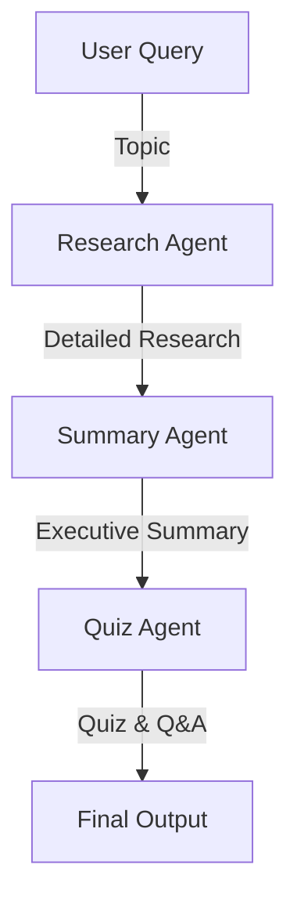

# Multi-Agent Research Assistant


A comprehensive, production-ready AI application that utilizes a multi-agent system to research, summarize, and generate educational quizzes on any given topic. Built with Python, Streamlit, LangGraph, and the Groq API.

## 🌟 Features

- **Multi-Agent Collaboration:** Employs three specialized AI agents working sequentially:
  - **Research Agent:** Deep-dives into the topic (Definition, History, Applications, etc.).
  - **Summary Agent:** Distills research into an executive summary and key takeaways.
  - **Quiz Agent:** Generates MCQs, short answer, and interview questions based on the summary.
- **Workflow Orchestration:** Uses LangGraph to manage state and data flow between agents.
- **Modern UI:** A beautiful Streamlit dashboard with progress indicators, tabs, and a sidebar.
- **Lightning Fast Inference:** Powered by the `llama-3.3-70b-versatile` model via Groq API.
- **Export Capabilities:** Download outputs as `.txt` files directly from the UI.
- **Robust Error Handling:** Validates inputs and API connections gracefully.

## 🏗 Architecture Diagram



## 🛠 Tech Stack

- **Backend:** Python 3.11+
- **Frontend:** Streamlit
- **LLM / Inference:** Groq API (`llama-3.3-70b-versatile`)
- **Agent Framework:** LangGraph, Langchain Core
- **Environment Management:** python-dotenv

## ⚙️ Installation & Setup

1. **Clone the repository or navigate to the directory:**
   ```bash
   cd MultiAgentResearchAssistant
   ```

2. **Create a Virtual Environment (Optional but recommended):**
   ```bash
   python -m venv venv
   # On Windows
   venv\Scripts\activate
   # On macOS/Linux
   source venv/bin/activate
   ```

3. **Install Dependencies:**
   ```bash
   pip install -r requirements.txt
   ```

4. **Configure Environment Variables:**
   - Open the `.env` file in the root directory.
   - Replace `your_key_here` with your actual Groq API key.
   ```env
   GROQ_API_KEY=gsk_xxxxxxxxxxxx...
   ```
   *Get your API key at [console.groq.com](https://console.groq.com).*

## 🚀 Running Instructions

Start the Streamlit application:

```bash
streamlit run app.py
```

The application will launch in your default web browser (typically at `http://localhost:8501`).

## 📸 Screenshots

*(Placeholders for future screenshots)*

- **Dashboard View:** `[Screenshot Placeholder]`
- **Research Tab:** `[Screenshot Placeholder]`
- **Summary & Quiz Tabs:** `[Screenshot Placeholder]`

## 🔮 Future Enhancements

- Integrate Web Search tools (e.g., Tavily) into the Research Agent for real-time data.
- Add support for exporting to PDF and Word documents.
- Allow users to select different LLM models via the sidebar.
- Implement user authentication to save research history.
